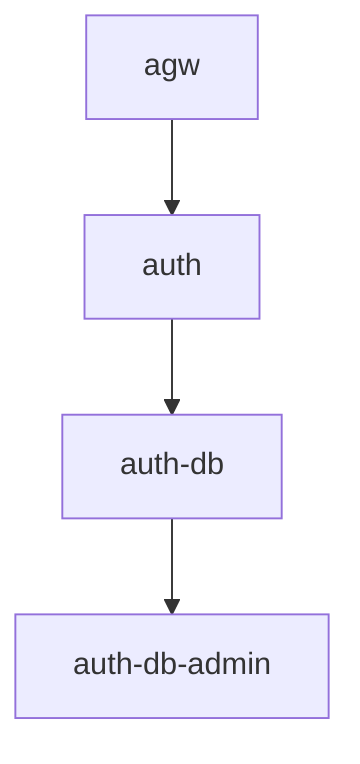

  
  <h1 style="text-align: center; margin-left: 10px; margin-top: 2px;">IT Lab Platform - Auth Service</h1>

  ✨
  
  Эта директория содержит исходный код системы аунтификации приложения "IT Lab Application".
  

## Structure

## Ports
- `8082` - pg Admin
- `3005` - app

## API
- /user
  - /devices
    - POST
    - parameters:
      - uuid: string(UUID)
      - select?:
        - name?: boolean
        - fingerprint?: boolean
        - isBlocked?: boolean
    - return:
      - Array:
        - name?: string
        - fingerprint?: string
        - isBlocked?: boolean
    - The select statement needs at least one truthy value.
