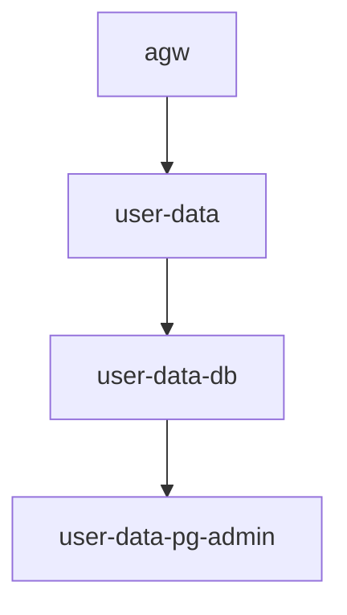

  
  <h1 style="text-align: center; margin-left: 10px; margin-top: 2px;">IT Lab Platform - User Data Service</h1>

  ✨
  
  Эта директория содержит исходный код сервиса базовых пользовательских данных приложения "IT Lab Application".
  

## Ports
- `8083` - pg Admin
- `3002` - app

## Structure

